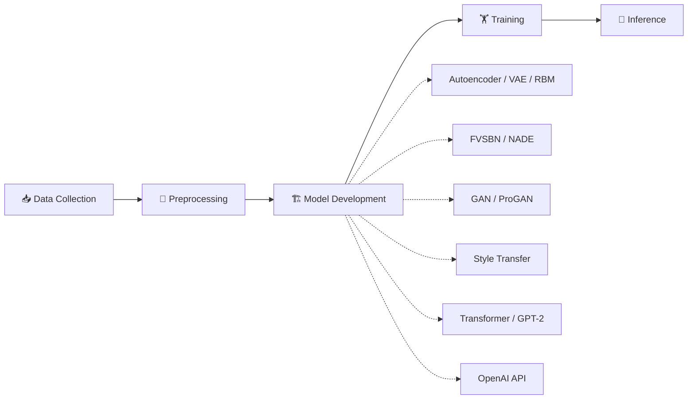

<div align="center">

# 🤖✨ Generative AI Lab
### *From "reconstruct this digit" to "answer my question like a wise oracle" — the full generative arc*

[](https://www.python.org/)
[](https://pytorch.org/)
[](https://huggingface.co/)
[](https://platform.openai.com/)
[](https://jupyter.org/)

[](#-license)
[](#)


*12 experiments tracing the entire family tree of Generative AI — from a humble autoencoder to a GPT-powered Q&A bot.* 🌳

</div>

---

## 📖 What's This All About?

This lab is basically a **guided tour through the evolution of Generative AI** — starting with models that just reconstruct what you fed them, and ending with a Large Language Model answering your questions like it's got somewhere to be.

Along the way: probabilistic latent spaces, adversarial rivalries, artistic style theft (the legal kind), and a transformer built from absolute scratch.

<details>
<summary><strong>🔍 Peek inside the notebook</strong></summary>

- 🧬 Autoencoders & Variational Autoencoders (VAEs)
- ⚡ Restricted Boltzmann Machines (energy-based models)
- 📈 Autoregressive models (FVSBN, NADE)
- 🎭 GANs — Vanilla & Progressive
- 🎨 Neural Style Transfer
- 🧠 Transformer language modeling from scratch
- ✍️ GPT-2 fine-tuning
- 💬 OpenAI API-powered Question Answering

</details>

---

## 🧪 The Experiments

<div align="center">

| Week/Exp | Model | Core Idea | Dataset |
|:-:|:--|:--|:--|
| Week 1 | Autoencoder | Learn to compress & reconstruct | MNIST |
| Week 2 | Restricted Boltzmann Machine | Energy-based feature learning | — |
| Week 3 | Variational Autoencoder (VAE) | Probabilistic latent generation | Fashion-MNIST |
| Week 4 | FVSBN | Autoregressive sequence modeling | AirPassengers · Bitcoin |
| Week 5 | NADE | Autoregressive density estimation | — |
| Week 6 | Improved NADE Variants | Better training & sampling | — |
| Exp 7 | Vanilla GAN | Adversarial image generation | CIFAR-10 |
| Exp 8 | Progressive GAN | High-res image synthesis | LSUN |
| Exp 9 | Neural Style Transfer | Content + style fusion | CIFAR-10 |
| Exp 10 | Transformer LM | Attention-based language modeling | WikiText-2 |
| Exp 11 | GPT-2 Fine-Tuning | Sentiment + text generation | IMDB Reviews |
| Exp 12 | OpenAI GPT Q&A | Prompt engineering + inference | — |

</div>

---

### 🧬 Week 1 — *"Squish It, Then Un-Squish It"*
**Autoencoder**

<details>
<summary>Show details 👇</summary>

The gateway drug of generative modeling: compress an image into a latent code, then rebuild it.

**Workflow:** Load MNIST → Preprocess → Encode → Learn latent representation → Decode → Reconstruct → Visualize

**Applications:** Image compression · Feature extraction · Noise reduction

</details>

---

### ⚡ Week 2 — *"Energy, But Make It a Neural Network"*
**Restricted Boltzmann Machine (RBM)**

<details>
<summary>Show details 👇</summary>

An unsupervised, energy-based model that learns hidden representations via Contrastive Divergence.

**Covers:** Contrastive Divergence · Hidden Layer Representation · Energy-Based Modeling

**Applications:** Recommendation systems · Representation learning · Dimensionality reduction

</details>

---

### 🎲 Week 3 — *"Autoencoder, But It Rolls Dice"*
**Variational Autoencoder (VAE)**

<details>
<summary>Show details 👇</summary>

Adds a probabilistic twist: instead of a fixed latent code, you get a distribution to sample from.

**Workflow:** Encoder → Latent Distribution → Reparameterization Trick → Decoder → Sample & Reconstruct

**Applications:** Image generation · Representation learning · Compression

</details>

---

### 📈 Week 4 — *"Predicting the Next Thing, One Step at a Time"*
**Fully Visible Sigmoid Belief Network (FVSBN)**

<details>
<summary>Show details 👇</summary>

Autoregressive probabilistic modeling applied to real sequential data — including, yes, Bitcoin prices.

**Datasets:** AirPassengers Time Series · Bitcoin Price Dataset

**Applications:** Financial forecasting · Demand prediction · Sequential data modeling

</details>

---

### 🎯 Week 5 — *"Density Estimation, Seriously This Time"*
**Neural Autoregressive Distribution Estimator (NADE)**

<details>
<summary>Show details 👇</summary>

Models high-dimensional probability distributions one conditional at a time.

**Covers:** Autoregressive density estimation · Likelihood estimation · Sequential prediction

**Applications:** Density estimation · Image modeling · Data generation

</details>

---

### 🔧 Week 6 — *"NADE, Now With Upgrades"*
**Improved NADE Variants**

<details>
<summary>Show details 👇</summary>

Refining the NADE recipe with better training strategies, sampling methods, and evaluation.

**Covers:** Improved training · Better sampling · Model comparison · Performance evaluation

</details>

---

### 🎭 Experiment 7 — *"Generator vs Discriminator, the Rematch"*
**Vanilla GAN**

<details>
<summary>Show details 👇</summary>

Two networks, one adversarial standoff, and a stream of increasingly convincing fake CIFAR-10 images.

**Workflow:** Generator ↔ Discriminator → Adversarial training → Fake image generation

**Applications:** Image generation · Data augmentation · Synthetic datasets

</details>

---

### 📐 Experiment 8 — *"Same GAN, But It Levels Up"*
**Progressive GAN (ProGAN)**

<details>
<summary>Show details 👇</summary>

Growing the GAN progressively — low resolution first, then scaling up — for stable, high-res image synthesis.

**Covers:** Progressive growing · Stable GAN training · Multi-resolution learning

**Applications:** High-resolution image generation · Digital art · AI-generated content

</details>

---

### 🎨 Experiment 9 — *"Borrowing Van Gogh's Brush, Digitally"*
**Neural Style Transfer**

<details>
<summary>Show details 👇</summary>

Blend a content image with a style image using feature extraction and a carefully balanced loss function.

**Workflow:** Content image + Style image → Feature extraction → Style loss + Content loss → Optimize → Stylized output

**Applications:** Artistic image generation · Image editing · Creative AI

</details>

---

### 🧠 Experiment 10 — *"Building a Transformer From Actual Scratch"*
**Transformer Language Model**

<details>
<summary>Show details 👇</summary>

No shortcuts here — positional encoding, multi-head attention, and encoder/decoder layers, all hand-assembled.

**Covers:** Positional Encoding · Multi-Head Attention · Feed Forward Networks · Encoder/Decoder Layers

**Metrics:** Training Loss · Validation Loss · Perplexity

**Applications:** Language modeling · Text prediction · Machine translation

</details>

---

### ✍️ Experiment 11 — *"GPT-2 Learns Your Vibe"*
**GPT-2 Fine-Tuning**

<details>
<summary>Show details 👇</summary>

Fine-tuning a pretrained GPT-2 for both sentiment classification and text generation on movie reviews.

**Workflow:** Tokenize → Load GPT-2 → Fine-tune → Classify sentiment → Generate text → Evaluate

**Applications:** Sentiment analysis · Content generation · Conversational AI

</details>

---

### 💬 Experiment 12 — *"Ask and You Shall Receive (via API)"*
**OpenAI GPT Question Answering**

<details>
<summary>Show details 👇</summary>

A practical Q&A application built on prompt engineering and the OpenAI API — no training required, just good prompts.

**Workflow:** User question → Prompt engineering → GPT response → Display answer

**Applications:** AI chatbots · Intelligent assistants · Customer support · Educational tutors

</details>

---

## 🛠️ Tech Stack

<div align="center">

| Category | Tools |
|:--|:--|
| **Core** |    |
| **Deep Learning** |   |
| **Transformers & LLMs** |    |
| **Utils** |   |

</div>

---

## 📂 Datasets Used

| Dataset | Used For | Vibe |
|:--|:--|:--|
| 🔢 MNIST | Autoencoder | "Digit, but blurrier, but still recognizable" |
| 👕 Fashion-MNIST | VAE | "Clothes, probabilistically" |
| ✈️ AirPassengers | Time Series Modeling | "Old but gold time-series classic" |
| 💰 Bitcoin Dataset | Autoregressive Prediction | "Predicting chaos, one step at a time" |
| 🖼️ CIFAR-10 | GAN & Style Transfer | "Tiny images, big adversarial energy" |
| 🌆 LSUN | Progressive GAN | "Scenes worth generating at high-res" |
| 📖 WikiText-2 | Transformer LM | "Wikipedia, but for training attention" |
| 🎬 IMDB Reviews | GPT-2 Fine-Tuning | "Teaching GPT-2 to judge movies" |

---

## 📊 The Complete Workflow



<details>
<summary><strong>📋 Step-by-step breakdown</strong></summary>

**1. Data Collection**
Download benchmark datasets → Load image and text data.

**2. Data Preprocessing**
Normalization → Tokenization → Image resizing → Batch preparation.

**3. Model Development**
Autoencoder, RBM, VAE, FVSBN, NADE, GAN, Progressive GAN, Neural Style Transfer, Transformer, GPT-2.

**4. Model Training**
Forward propagation → Loss computation → Backpropagation → Optimization → Validation.

**5. Inference**
Image generation · Text generation · Question answering · Style transfer · Sentiment prediction.

</details>

---

## 📁 Project Structure

```
Generative-AI-Lab/
│
├── GENAILAB.ipynb        # All 12 experiments, start to finish
├── README.md             # You are here 👋
├── requirements.txt      # Dependencies
└── datasets/             # Local dataset storage
```

---

## ⚙️ Quick Start

### 1️⃣ Clone it
```bash
git clone https://github.com/SiriNandinii/Generative-AI-Lab.git
cd Generative-AI-Lab
```

### 2️⃣ Install the goodies
```bash
pip install torch torchvision torchaudio
pip install transformers datasets
pip install openai
pip install matplotlib numpy
```

### 3️⃣ Fire up Jupyter
```bash
jupyter notebook
```

### 4️⃣ Open & run
```
GENAILAB.ipynb  →  Run All Cells ▶️
```

> 🔑 Heads up: Experiment 12 needs an OpenAI API key set as an environment variable. GANs and Transformers appreciate a GPU too.

---

## 🌟 Highlights Reel

<div align="center">

| ✅ | Highlight |
|:--:|:--|
| 🧬 | Full generative model family tree, AE → VAE → GAN → Transformer → GPT |
| ⚡ | Energy-based & autoregressive models (RBM, FVSBN, NADE) |
| 🎭 | Vanilla + Progressive GANs |
| 🎨 | Neural style transfer |
| 🧠 | Transformer built from scratch |
| ✍️ | GPT-2 fine-tuning for sentiment + generation |
| 💬 | OpenAI API-powered Q&A |
| 🔄 | End-to-end training and inference pipeline |

</div>

---

## 🎯 What You'll Walk Away With

- 🧠 Generative AI fundamentals, from classical to modern
- 🎲 Latent representation learning
- ⚡ Energy-based models
- 🎭 GAN training (vanilla & progressive)
- 🎨 Neural style transfer
- 🧩 Transformer architecture, built by hand
- ✍️ GPT fine-tuning
- 💬 Prompt engineering & OpenAI API integration
- 🚀 A real appreciation for how far generative models have come

---

## 🚀 Future Improvements

- [ ] Stable Diffusion
- [ ] Diffusion Models (DDPM)
- [ ] StyleGAN2 / StyleGAN3
- [ ] CycleGAN
- [ ] Pix2Pix
- [ ] CLIP
- [ ] DALL·E Integration
- [ ] LoRA Fine-Tuning
- [ ] LLaMA
- [ ] Mistral
- [ ] Gemma
- [ ] Retrieval-Augmented Generation (RAG)
- [ ] LangChain
- [ ] Multi-Agent AI Systems
- [ ] Streamlit Deployment

---

## 💡 Real-World Applications

<div align="center">

| 🌍 | Application |
|:--:|:--|
| 🤖 | AI content generation |
| 💬 | Chatbots |
| 🖼️ | Image synthesis |
| 📝 | Text summarization |
| 💻 | Code generation |
| 🎯 | Recommendation systems |
| 🗣️ | Conversational AI |
| 🎨 | Creative AI |
| 🧑‍💼 | Virtual assistants |
| 🔍 | AI-powered search |

</div>

---

## 👩‍💻 Author

<div align="center">

**Siri Nandini Alanka**

*AI & Machine Learning Student | Generative AI Enthusiast | Full Stack Developer*

[](https://github.com/SiriNandinii)

</div>

---

## 📄 License


This project is intended for **educational, research, and learning purposes**. Feel free to use, modify, and extend the implementations with proper attribution. 🙏

---

## 🙌 Acknowledgements

Huge thanks to:

<div align="center">


</div>

for the open-source frameworks, pretrained models, APIs, and research that made these Generative AI experiments possible.

---

<div align="center">

### ⭐ If a GAN of yours ever produced something beautiful, this repo deserves a star.

*Built one latent vector at a time.* 🎲✨

</div>
